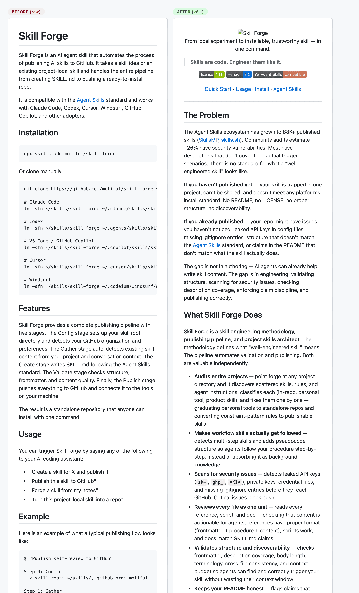

<div align="center">

  <picture>
    <source media="(prefers-color-scheme: dark)" srcset=".github/logo-dark.svg">
    <source media="(prefers-color-scheme: light)" srcset=".github/logo-light.svg">
    
  </picture>

</div>

<div align="center">

[![License: MIT][license-shield]][license-url]
[![Version][version-shield]][version-url]
[![Agent Skills][skills-shield]][skills-url]

</div>

<div align="center">
  <a href="#the-problem">Why</a> &middot;
  <a href="#quick-start">Quick Start</a> &middot;
  <a href="#usage">Usage</a> &middot;
  <a href="#install">Install</a>
</div>

> Layout-first README generation — organize by how readers scan, not by what you want to say.

[Agent Skills](https://agentskills.io) compatible — works with Claude Code, Codex, Cursor, Windsurf, GitHub Copilot, and other Agent Skills adopters.

---

<div align="center">
  
  <p><em>Before → After: <a href="docs/case-study-skill-forge.md">Skill Forge case study</a></em></p>
</div>

## The Problem

Most READMEs are either walls of text that bury what matters, or empty stubs that tell readers nothing. Many README generators and builders help with section selection, repo summarization, or template filling, but they still tend to optimize for completeness over reading order.

If you write READMEs for GitHub repos and want them to be scannable from the first screen, readme-craft is for you.

readme-craft focuses on the final reading experience: a **3-tier layout strategy** that decides what belongs above the fold, what should be easy to scan, and what deep content moves to `docs/`. It is a GitHub-native, layout-first README skill for READMEs that need to serve both human readers and the agents that will keep iterating on them.

**Not for:** brand identity design, non-GitHub platforms (GitLab/Bitbucket rendering differs), or non-Markdown documentation formats (Sphinx, Docusaurus, etc.).

## What readme-craft Does

| Tier | Content | Purpose |
|------|---------|---------|
| **1** Above the fold (~250px) | Logo, name, one-liner, badges, quick links | 3-second pitch |
| **2** Scan quickly (2-3 screens) | Problem, features, quick start, install, usage | Prove value |
| **3** Supporting content | Config, API, structure, roadmap, contributing | Serve committed users |

**Three ways to use it:**

- **Starting a new project?** — Mode A creates a README from a short project description
- **Have code but no README?** — Mode B scans your codebase and generates one
- **README already exists but needs work?** — Mode C evaluates it against the checklist and applies targeted fixes

**Features:**

- **Organizes by how readers scan, not what you want to say** — the 3-tier layout strategy puts the pitch above the fold, proof in the scan zone, and supporting content as teasers linking to `docs/`
- **45-point quality audit** — evaluates structure, content, formatting, user perspective, completeness, and reader lens with specific pass/fail criteria for each
- **Separates Features from How It Works** — prevents the common anti-pattern of writing pipeline stages where user-facing capabilities should go; inventories all capabilities before writing
- **Generates dark/light SVG wordmarks** — 9 presets across 2 rendering engines (figlet + cfonts), 45 named gradient palettes, human-in-the-loop candidate selection
- **Selects badges by priority** — 6-level priority system (license → version → CI → downloads → coverage → platform) with copy-paste patterns for every ecosystem
- **Enforces tone and voice** — addresses the reader as "you", uses third person for the software, strips hype words; in improvement mode, preserves the author's existing voice
- **Applies GitHub-native formatting** — `<picture>` for dark/light logos, teaser + `docs/` links for deep content, relative links for doc splits, reference-style badges, Mermaid/math only when faster than prose
- **Generates before/after comparison screenshots** — side-by-side or stacked PNGs via Playwright for case studies and visual proof
- **Manages GitHub metadata** — generates `.github/repo-meta.yml` with description and 3-tier topic selection for repository discoverability
- **Ships reusable templates with guidance** — dedicated layouts for general OSS projects and AI agent skills, with benefit-oriented placeholders and HTML comment instructions

## Quick Start

```bash
npx skills add motiful/readme-craft
```

Then tell your AI coding assistant:

```text
"Generate a README for this project"    # scans codebase, selects template, fills 3-tier layout
"Improve this README"                   # evaluates against 45-point checklist, applies targeted fixes
"Review my README"                      # audits structure, content, and reader experience
```

## When to Reach for It

- You are about to publish a repo and need a README from scratch
- You got feedback that your README is "too long" or "hard to follow"
- You want to review an existing README against a concrete quality checklist
- You are packaging an AI agent skill and need the skill-specific template

## Usage

```text
"Write a README for this project"
"Generate a README"
"Improve this README"
"Review my README"
"Add badges to my README"
"Fix my README layout"
```

**Example**

Sample flow, not a transcript from a verified run:

> User: "Generate a README for this project"
>
> readme-craft will:
> 1. Scan the codebase for project metadata, dependencies, and structure
> 2. Select the appropriate template (universal or skill-specific)
> 3. Fill the template using detected information
> 4. Apply the 3-tier layout strategy
> 5. Run the quality checklist and report any issues

**Typical output**

- Tier 1 keeps the value proposition, trust badges, and quick links visible immediately.
- Tier 2 keeps problem, features, usage, and install sections short enough to scan without hunting.
- Tier 3 keeps deep reference (structure, configuration, roadmap) as teasers linking to `docs/`.

## Install

Install directly from the public GitHub repository:

```bash
npx skills add motiful/readme-craft
```

**Manual registration** (clone + symlink):

```bash
git clone https://github.com/motiful/readme-craft ~/skills/readme-craft

# Register only in roots you actually use.
ln -sfn ~/skills/readme-craft ~/.claude/skills/readme-craft      # Claude Code
ln -sfn ~/skills/readme-craft ~/.agents/skills/readme-craft      # Codex
ln -sfn ~/skills/readme-craft ~/.copilot/skills/readme-craft     # VS Code / GitHub Copilot
ln -sfn ~/skills/readme-craft ~/.cursor/skills/readme-craft      # Cursor
ln -sfn ~/skills/readme-craft ~/.codeium/windsurf/skills/readme-craft  # Windsurf
```

### Prerequisites

The main README writing and review flow does not require repo-local dependencies. The only local runtime path is fallback logo generation.

- **Node.js 18+** with `npm` — required only when generating a fallback SVG wordmark with the local helper
- Run `npm install` in the `readme-craft` root before using the logo generator
- If the project already has a logo, you can skip this step

## How It Works

readme-craft operates in three modes: create from scratch (no code), create from codebase (scan + generate), and improve existing (evaluate + targeted fixes). All three produce READMEs organized by the 3-tier layout strategy with GitHub-native formatting.

→ [Operation modes, tier strategy, and formatting details](docs/how-it-works.md)

## Contributing

See [CONTRIBUTING.md](CONTRIBUTING.md) for contribution workflow and validation steps.

## License

MIT — See [LICENSE](LICENSE) for details.

---

Forged with [Skill Forge](https://github.com/motiful/skill-forge) · Crafted with [Readme Craft](https://github.com/motiful/readme-craft)

<!-- Reference-style link definitions -->
[license-shield]: https://img.shields.io/badge/License-MIT-green.svg
[license-url]: LICENSE
[version-shield]: https://img.shields.io/badge/version-1.0-blue.svg
[version-url]: SKILL.md
[skills-shield]: https://img.shields.io/badge/Agent%20Skills-compatible-DA7857?logo=anthropic
[skills-url]: https://agentskills.io
