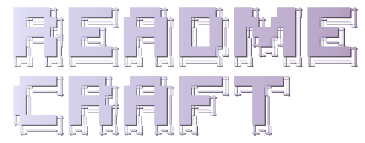

<div align="center">

  <picture>
    <source media="(prefers-color-scheme: dark)" srcset="logo-dark.svg">
    <source media="(prefers-color-scheme: light)" srcset="logo-light.svg">
    
  </picture>

</div>

<div align="center">

[![License: MIT][license-shield]][license-url]
[![Version][version-shield]][version-url]
[![Agent Skills][skills-shield]][skills-url]

</div>

<div align="center">
  <a href="#the-problem">Why</a> &middot;
  <a href="#when-to-reach-for-it">When</a> &middot;
  <a href="#usage">Usage</a> &middot;
  <a href="#install">Install</a>
</div>

> Layout-first README generation — organize by how readers scan, not by what you want to say.

[Agent Skills](https://agentskills.io) compatible — works with Claude Code, Codex, Cursor, Windsurf, GitHub Copilot, and other Agent Skills adopters.

---

<div align="center">
  
  <p><em>Before → After: <a href="docs/case-study-skill-forge.md">Skill Forge case study</a></em></p>
</div>

## The Problem

Most READMEs are either walls of text that bury what matters, or empty stubs that tell readers nothing. Many README generators and builders help with section selection, repo summarization, or template filling, but they still tend to optimize for completeness over reading order.

If you write READMEs for GitHub repos and want them to be scannable from the first screen, readme-craft is for you.

readme-craft focuses on the final reading experience: a **3-tier layout strategy** that decides what belongs above the fold, what should be easy to scan, and what should be folded into reference material. It is a GitHub-native, layout-first README skill for READMEs that need to serve both human readers and the agents that will keep iterating on them.

**Not for:** brand identity design, non-GitHub platforms (GitLab/Bitbucket rendering differs), or non-Markdown documentation formats (Sphinx, Docusaurus, etc.).

## What readme-craft Does

| Tier | Content | Purpose |
|------|---------|---------|
| **1** Above the fold (~250px) | Logo, name, one-liner, badges, quick links | 3-second pitch |
| **2** Scan quickly (2-3 screens) | Problem, features, quick start, install, usage | Prove value |
| **3** Reference (collapsible) | Config, API, structure, roadmap, contributing | Serve committed users |

**Three ways to use it:**

- **Starting a new project?** — Mode A creates a README from a short project description
- **Have code but no README?** — Mode B scans your codebase and generates one
- **README already exists but needs work?** — Mode C evaluates it against the checklist and applies targeted fixes

**Key capabilities:**

- **3-tier layout strategy** — information hierarchy based on how visitors actually consume READMEs
- **GitHub-native formatting and badge guidance** — `<details>`, relative links, tables, and trust signals that improve scan speed
- **Logo handling** — preserve existing brand assets or generate a README-safe fallback SVG wordmark
- **Interactive improvement flow** — asks before social proof, docs splits, or stricter visual choices when those tradeoffs matter
- **Quality checklist and templates** — reusable review criteria plus dedicated layouts for OSS repos and AI agent skills

## When to Reach for It

- You are about to publish a repo and need a README from scratch
- You got feedback that your README is "too long" or "hard to follow"
- You want to review an existing README against a concrete quality checklist
- You are packaging an AI agent skill and need the skill-specific template

## Usage

```text
"Write a README for this project"
"Generate a README"
"Improve this README"
"Review my README"
"Add badges to my README"
"Fix my README layout"
```

**Example**

Sample flow, not a transcript from a verified run:

> User: "Generate a README for this project"
>
> readme-craft will:
> 1. Scan the codebase for project metadata, dependencies, and structure
> 2. Select the appropriate template (universal or skill-specific)
> 3. Fill the template using detected information
> 4. Apply the 3-tier layout strategy
> 5. Run the quality checklist and report any issues

**Typical output**

- Tier 1 keeps the value proposition, trust badges, and quick links visible immediately.
- Tier 2 keeps problem, features, usage, and install sections short enough to scan without hunting.
- Tier 3 folds structure, configuration, roadmap, and contribution details into reference sections.

## Install

Install directly from the public GitHub repository:

```bash
npx skills add motiful/readme-craft
```

<details>
<summary>Common skill roots</summary>

```bash
git clone https://github.com/motiful/readme-craft ~/skills/readme-craft

# Pick only the roots you actually use.
# You do not need to register every platform.
# If a root does not exist yet, create it only intentionally.

# Claude Code
ln -sfn ~/skills/readme-craft ~/.claude/skills/readme-craft

# Codex
ln -sfn ~/skills/readme-craft ~/.agents/skills/readme-craft

# VS Code / GitHub Copilot
ln -sfn ~/skills/readme-craft ~/.copilot/skills/readme-craft

# Cursor (if your setup ignores the symlink, use a real copy instead)
ln -sfn ~/skills/readme-craft ~/.cursor/skills/readme-craft

# Windsurf
ln -sfn ~/skills/readme-craft ~/.codeium/windsurf/skills/readme-craft
```

</details>

---

<details>
<summary><strong>Prerequisites</strong></summary>

The main README writing and review flow does not require repo-local dependencies. The only local runtime path is fallback logo generation.

- **Node.js 18+** with `npm` — required only when generating a fallback SVG wordmark with the local helper
- Run `npm install` in the `readme-craft` root before using the logo generator
- If the project already has a logo, you can skip this step

The logo generator (`scripts/generate-logo.mjs`) runs locally, reads no external data, and requires no special permissions. It uses `figlet` and `cfonts` npm packages to render text into SVG files.

</details>

<details>
<summary><strong>How It Works</strong></summary>

### Three Operation Modes

**Mode A: Create from Scratch** — User describes a project without code. The skill collects project info (name, description, features, license), selects a template, and produces a 3-tier README.

**Mode B: Create from Codebase** — Scans the project for package configs, entry points, CI config, and existing docs. Synthesizes findings into a complete README using the detected ecosystem.

**Mode C: Improve Existing** — Evaluates an existing README against the 3-tier strategy and quality checklist. Produces a numbered improvement plan, then applies changes while preserving the author's voice.

### The 3-Tier Layout Strategy

The core differentiator. Every README organizes content by how visitors consume information:

- **Tier 1 (~250px):** The storefront window — logo, name, value proposition, trust badges, quick links. Visitors who aren't interested leave here.
- **Tier 2 (2-3 screens):** The product demo — problem statement, features, quick start, install, usage. Proves the project is worth adopting.
- **Tier 3 (collapsible):** The reference manual — config, API, project structure, contributing, roadmap. Wrapped in `<details>` for committed users.

### GitHub-Native Formatting

readme-craft treats GitHub formatting as part of the README architecture, not as decoration:

- Use `<details>` to keep reference material out of the main reading path.
- Use relative links when the README needs to spill into `docs/` or sibling markdown files.
- Use Mermaid, math, or footnotes only when they explain faster than plain prose.
- Keep social proof optional. Stars, contributors, and popularity signals should be deliberate, not default.

</details>

<details>
<summary><strong>What's Inside</strong></summary>

```text
readme-craft/
├── SKILL.md                                # Skill definition — modes, tiers, and checklist
├── assets/
│   ├── universal-readme.md                 # Template for general OSS projects
│   └── skill-readme.md                     # Template for AI agent skills
├── references/
│   ├── badges.md                           # Copy-paste badge patterns by ecosystem
│   ├── github-formatting.md                # GitHub-native formatting and overflow strategy
│   ├── logo-generation.md                  # Fallback logo rules, presets, and runtime requirements
│   ├── logo-examples.md                    # Example mappings from project feel to logo preset
│   ├── gradient-palettes.md                # 2026-curated gradient palette reference
│   └── comparison-screenshots.md           # Before/after comparison PNG generation
└── scripts/
    ├── generate-logo.mjs                   # Local helper for fallback README wordmarks
    ├── generate-comparison.mjs             # CLI for before/after comparison PNGs
    ├── logo/                               # Logo engine modules (figlet, cfonts, SVG)
    └── comparison/                         # Comparison rendering and screenshot modules
```

</details>

## Contributing

See [CONTRIBUTING.md](CONTRIBUTING.md) for contribution workflow and validation steps.

## License

MIT — See [LICENSE](LICENSE) for details.

---

Forged with [Skill Forge](https://github.com/motiful/skill-forge) · Crafted with [Readme Craft](https://github.com/motiful/readme-craft)

<!-- Reference-style link definitions -->
[license-shield]: https://img.shields.io/badge/License-MIT-green.svg
[license-url]: LICENSE
[version-shield]: https://img.shields.io/badge/version-1.0-blue.svg
[version-url]: SKILL.md
[skills-shield]: https://img.shields.io/badge/Agent%20Skills-compatible-DA7857?logo=anthropic
[skills-url]: https://agentskills.io
