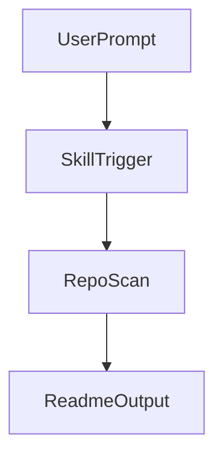

# Skill README Template (SkillForge-Enhanced)

> This template extends the universal template with Agent Skills-specific sections.
> Replace all `<placeholders>` and remove this instruction block before publishing.

---

<!-- ============================================================ -->
<!-- TIER 1: ABOVE THE FOLD — Your 3-second pitch                 -->
<!-- ============================================================ -->

<!-- Logo: dark/light mode support -->
<div align="center">
  <picture>
    <source media="(prefers-color-scheme: dark)" srcset="<assets/logo-dark.svg>">
    <source media="(prefers-color-scheme: light)" srcset="<assets/logo-light.svg>">
    " src="<assets/logo-light.svg>" width="120">
  </picture>

  <!-- If a generated wordmark already spells the project name clearly, prefer a visually single-line Tier 1 and omit the separate <h1> instead of stacking the name twice. -->
  <h1><skill-name></h1>
  <p><one-line value proposition — what problem this solves, not what it is></p>
</div>

<div align="center">

<!-- Badges: pick the most relevant 4-6 -->
[![License: <license>][license-shield]][license-url]
[![Version][version-shield]][version-url]
[![Agent Skills][skills-shield]][skills-url]

</div>

<!-- Optional social proof for public repositories with real numbers only.
[![GitHub stars][stars-shield]][stars-url]
[![Contributors][contributors-shield]][contributors-url]
-->

<div align="center">
  <a href="#the-problem">Why</a> &middot;
  <a href="#usage">Usage</a> &middot;
  <a href="#install">Install</a> &middot;
  <a href="<docs-or-demo-url>">Docs</a>
</div>

<br>

[Agent Skills](https://agentskills.io) compatible — works with Claude Code, Codex, Cursor, Windsurf, GitHub Copilot, and other Agent Skills adopters.

---

<!-- ============================================================ -->
<!-- TIER 2: SCAN QUICKLY — Prove value to interested visitors     -->
<!-- ============================================================ -->

## The Problem

<2-4 sentences describing the pain point. Be specific — what goes wrong without this skill? What does the user waste time on?>

## Features

- <capability 1 — what the user gets, not how it works internally>
- <capability 2>
- <capability 3>
- <capability 4>

<!-- Write each feature as a user-facing capability.
✓ "Detects leaked API keys before you push"
✗ "Runs regex patterns against staged file diffs"
If you find yourself describing internal steps or pipeline stages, move that to How It Works in Tier 3. -->

## Usage

<Trigger phrases that activate this skill. What does the user say?>

```text
"<trigger phrase 1>"
"<trigger phrase 2>"
"<trigger phrase 3>"
```

**Example**

Sample flow, unless you replace it with a verified run:

> User: "<example prompt>"
>
> <skill-name> will:
> 1. <step 1>
> 2. <step 2>
> 3. <step 3>

<!-- Optional GitHub-native enhancement:
Add Mermaid only if a flow, architecture, or interaction model is clearer as a diagram.
If deeper reference material would crowd the README, move it into docs/ with relative links. -->

## Architecture At A Glance

<!-- Delete this section if a diagram would not explain faster than prose. -->



## Install

```bash
npx skills add <org>/<skill-name>
```

<details>
<summary>Manual registration</summary>

```bash
git clone https://github.com/<org>/<skill-name> ~/skills/<skill-name>

# Pick only the roots you actually use.
# You do not need to register every platform.
# If a root does not exist yet, create it only intentionally.

# Claude Code
ln -sfn ~/skills/<skill-name> ~/.claude/skills/<skill-name>

# Codex
ln -sfn ~/skills/<skill-name> ~/.agents/skills/<skill-name>

# VS Code / GitHub Copilot
ln -sfn ~/skills/<skill-name> ~/.copilot/skills/<skill-name>

# Cursor (if your setup ignores the symlink, use a real copy instead)
ln -sfn ~/skills/<skill-name> ~/.cursor/skills/<skill-name>

# Windsurf
ln -sfn ~/skills/<skill-name> ~/.codeium/windsurf/skills/<skill-name>
```

</details>

## Works Better With

<Optional. Include only when recommended skills provide a real enhancement without becoming required dependencies. Delete this section if not used.>

- [`<org>/<recommended-skill>`](https://github.com/<org>/<recommended-skill>) — <specific enhancement>. Install: `npx skills add <org>/<recommended-skill>`

This skill still works fully on its own.

## Further Reading

<!-- Delete this section if everything important fits in README.md. -->

- [Design Notes](docs/design.md)
- [Formatting Rules](docs/formatting.md)
- [Examples](docs/examples.md)

---

<!-- ============================================================ -->
<!-- TIER 3: REFERENCE — Serve committed users                    -->
<!-- ============================================================ -->

<details>
<summary><strong>How It Works</strong></summary>

<Internal mechanism, pipeline stages, or architecture.
This is where workflow diagrams, step-by-step internal logic, and technical details belong.
Keep Tier 2 Features focused on what the user gets; put the "how" here.>

</details>

<details>
<summary><strong>What's Inside</strong></summary>

```text
SKILL.md              — <short description>
references/           — <if applicable>
  <file>.md           — <what it contains>
scripts/              — <if applicable>
  <file>.<ext>        — <what it does>
```

</details>

<details>
<summary><strong>Configuration</strong></summary>

<If the skill has configurable behavior, document it here.>

| Option | Default | Description |
|--------|---------|-------------|
| <option> | <default> | <description> |

</details>

## Contributing

Contributions are welcome. See [CONTRIBUTING.md](CONTRIBUTING.md) for guidelines.

<!-- If you don't have a separate CONTRIBUTING.md, replace this section with
1. Fork the repository
2. Create a feature branch (`git checkout -b feature/<name>`)
3. Commit your changes
4. Push to the branch
5. Open a Pull Request
-->

## License

<license-type> — See [LICENSE](LICENSE) for details.

---

Crafted with [Readme Craft](https://github.com/motiful/readme-craft)

<!-- Reference-style link definitions -->
[license-shield]: https://img.shields.io/badge/License-<license>-<color>.svg
[license-url]: <license-url>
[version-shield]: https://img.shields.io/badge/version-<version>-blue.svg
[version-url]: <releases-url>
[skills-shield]: https://img.shields.io/badge/Agent%20Skills-compatible-DA7857?logo=anthropic
[skills-url]: https://agentskills.io
<!-- [stars-shield]: https://img.shields.io/github/stars/<org>/<skill-name>?style=social -->
<!-- [stars-url]: https://github.com/<org>/<skill-name>/stargazers -->
<!-- [contributors-shield]: https://img.shields.io/github/contributors/<org>/<skill-name>.svg -->
<!-- [contributors-url]: https://github.com/<org>/<skill-name>/graphs/contributors -->
