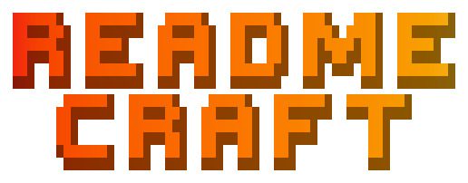
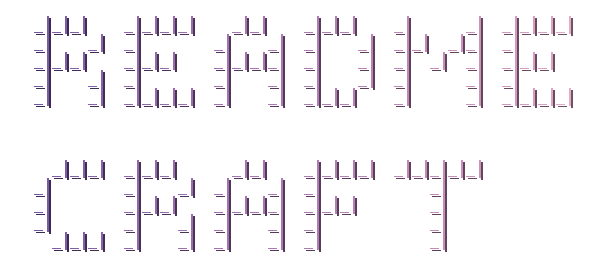
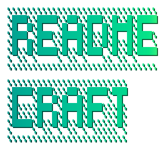

# Logo Preset Gallery

Visual reference for all logo presets available in readme-craft's logo generator.

## Figlet Family

Stable presets recommended for production README headers.

### figlet-dos-rebel-main

Dense, structured, tool-like. Default palette: ocean.


### figlet-dos-rebel-inline

Softer, more product-like. Default palette: sunset.


### figlet-ansi-shadow-sharp

Poster-like, bold alternative. Default palette: solar-flare.



## cfonts Family

Block-art presets with multi-line rendering for compound names.

### cfonts-block-compact

Strongest general-purpose cfonts baseline. Default palette: ocean.


### cfonts-simpleblock-slim

Slimmer block texture. Default palette: ocean.



### cfonts-shade-default

Soft metallic texture. Default palette: forest.



### cfonts-shade-crisp

Brighter, cleaner shade treatment. Default palette: ocean.


### cfonts-tiny-tall

Compact micro-display style. Default palette: ocean.


### cfonts-console-neutral

Minimal monospace text fallback. Default palette: sunset.


## Palettes

Run `node scripts/generate-logo.mjs --list-palettes` for the full list.

| Name | Colors | Feel |
|------|--------|------|
| sunset | #ff9966 → #ff5e62 | Warm, energetic |
| ocean | #2193b0 → #6dd5ed | Cool, professional |
| forest | #11998e → #38ef7d | Green, natural |
| solar-flare | #f12711 → #f5af19 | Red-orange, bold |
| synthwave | #b721ff → #21d4fd | Purple-cyan, electric |
| arctic | #43CEA2 → #185A9D | Teal-blue, cold |
| voltage | #FBDA61 → #FF5ACD | Yellow-pink, vivid |
| ultraviolet | #654ea3 → #eaafc8 | Purple, dreamy |
| midnight | #232526 → #414345 | Dark, subtle |
| plasma | #FF0099 → #493240 | Hot pink, dramatic |

## CLI Quick Reference

| Command | Description |
|---------|-------------|
| `--candidates 5` | Generate 5 random candidates for HITL selection |
| `--random` | Pick one random preset from reliable pool + random palette |
| `--preset <name>` | Use a specific preset |
| `--palette <name>` | Override the default palette |
| `--dual` | Generate light + dark variants |
| `--pack baselines` | Generate all baseline presets for comparison |

```sh
npm run logo:list                                          # List all presets
npm run logo:generate -- --name "my-project"               # Generate with default preset
npm run logo:random -- --name "my-project"                 # Random reliable preset + palette
npm run logo:candidates -- --name "my-project" --candidates 5  # HITL candidate selection
npm run logo:examples                                      # Regenerate example gallery
```
